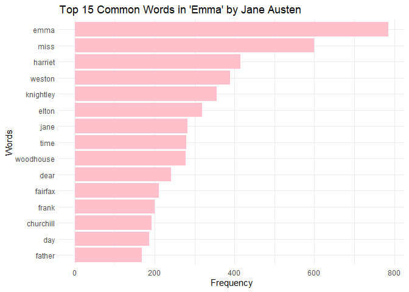

## Background

Using the *janeaustenr* package, I will filter for the book “Emma”, I
will be counting the number of words, and plotting the frequency of the
most common words in bar chart using ggplot2. I will also remove stop
words using the tidytext, stop\_words() function.

    # Filtering for "Emma" specifically from the package "janeaustenr"
    emma_book <- austen_books() %>%
        filter(book == "Emma") %>%  
        mutate(line = row_number())  

    # breaking text into words
    emma_tidied <- emma_book %>%
        unnest_tokens(word, text)  

    # removing stop words using tidytext::stop_words
    emma_filtered <- emma_tidied %>%
        anti_join(tidytext::stop_words, by = "word")  

    # counting frequency of most common words used in the book in descending order
    emma_word_count <- emma_filtered %>%
        count(word, sort = TRUE)  

    # extracting the top 15 most frequently occurring words for visualization.
    emma_top_words <- emma_word_count[1:15, ]

    # Create the plot
    graph_exercise1 <- ggplot(emma_top_words, aes(x = reorder(word, n), y = n)) +
        geom_col(fill = "pink") +  
        coord_flip() + 
        labs(
            title = "Top 15 Common Words in 'Emma' by Jane Austen",
            x = "Words",
            y = "Frequency"
        ) +
        theme_minimal()

    # plot
    graph_exercise1

