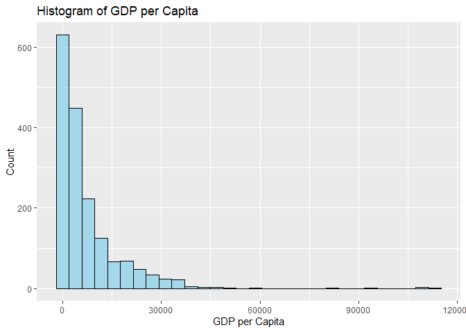
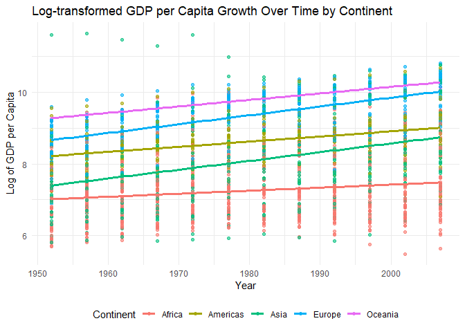

# Objective of the data analysis

I will be performing data analysis on the gapminder dataset, where I’ll
be analyzing how GDP per capita has changed over time for each
continent. I will first run a linear regression model where GDP per
capita is my dependent variable and year is independent variable. As my
focus is on growth of continents over time, not their initial value at
1950, I would not interpret the intercept term rigorously.

But before doing so, I want to check whether the data is positively
skewed as GDP per capita historically is. If it is skewed, I will log
transform the variable and then perform the linear regression.

    # Cleaning up gapminder
    gap <- gapminder %>%
      as_tibble()

    # checking for skewness
    ggplot(gap, aes(x = gdpPercap)) + 
      geom_histogram(bins = 30, fill = "skyblue", color = "black", alpha = 0.7) +
      labs(title = "Histogram of GDP per Capita", x = "GDP per Capita", y = "Count")

 As
the graph showed positive skewness, I will log-transform GDP per capita
and fit a regression model. The slope in the log-transformed model
represents the change in the logarithm of GDP per capita for each year.
For the purpose of interpretation, I have transformed the slope of the
regression model as the percentage change in GDP per capita over time
using the formula Percentage change=(exp (slope) − 1) × 100

This will make it easy to understand at what rate GDP per capita of each
continent is growing.

    # Log-transform the GDP per capita
    gap <- gap %>%
      mutate(log_gdpPercap = log(gdpPercap))

    # Grouping data by continent, fitting a linear model on log-transformed GDP per capita
    continent_models_log <- gap %>%
      group_by(continent) %>%
      nest() %>%
      mutate(
        model = map(data, ~ lm(log_gdpPercap ~ year, data = .))  # Use log-transformed GDP per capita
      )

    # Extracting the coefficients from the models
    coefficients_log <- continent_models_log %>%
      mutate(coefficients = map(model, broom::tidy)) %>%
      select(continent, coefficients) %>%
      unnest(coefficients)

    #Printing the intermediate table #1
    print(coefficients_log)

    ## # A tibble: 10 × 6
    ## # Groups:   continent [5]
    ##    continent term         estimate std.error statistic  p.value
    ##    <fct>     <chr>           <dbl>     <dbl>     <dbl>    <dbl>
    ##  1 Asia      (Intercept) -40.4       7.14        -5.65 3.06e- 8
    ##  2 Asia      year          0.0245    0.00361      6.78 4.36e-11
    ##  3 Europe    (Intercept) -39.6       3.62       -10.9  3.04e-24
    ##  4 Europe    year          0.0247    0.00183     13.5  5.63e-34
    ##  5 Africa    (Intercept)  -9.46      3.89        -2.43 1.54e- 2
    ##  6 Africa    year          0.00844   0.00197      4.29 2.05e- 5
    ##  7 Americas  (Intercept) -19.7       4.22        -4.67 4.58e- 6
    ##  8 Americas  year          0.0143    0.00213      6.71 9.78e-11
    ##  9 Oceania   (Intercept) -26.2       2.27       -11.5  8.30e-11
    ## 10 Oceania   year          0.0182    0.00115     15.9  1.60e-13

    # Filtering for only the slope (exclude intercept), then pivot wider
    coeff_table_log <- coefficients_log %>%
      filter(term == "year") %>%  # Only keep rows where the term is "year"
      pivot_wider(names_from = term, values_from = estimate) %>%
      rename(slope = year)  # Rename the slope column for clarity

    # Adding percentage change based on slope (column) to the same table 
    coeff_table_log <- coeff_table_log %>%
      mutate(
        percentage_change = (exp(slope) - 1) * 100  
      )

    #Printing the intermediate table #2
    print(coeff_table_log)

    ## # A tibble: 5 × 6
    ## # Groups:   continent [5]
    ##   continent std.error statistic  p.value   slope percentage_change
    ##   <fct>         <dbl>     <dbl>    <dbl>   <dbl>             <dbl>
    ## 1 Asia        0.00361      6.78 4.36e-11 0.0245              2.48 
    ## 2 Europe      0.00183     13.5  5.63e-34 0.0247              2.50 
    ## 3 Africa      0.00197      4.29 2.05e- 5 0.00844             0.848
    ## 4 Americas    0.00213      6.71 9.78e-11 0.0143              1.44 
    ## 5 Oceania     0.00115     15.9  1.60e-13 0.0182              1.83

    # I want to round up all numeric values of the table to three decimal places
    final_table_clean <- coeff_table_log %>%
      mutate(
        std.error = round(std.error, 3),
        statistic = round(statistic, 3),
        p.value = round(p.value, 3),
        slope = round(slope, 3),
        percentage_change = round(percentage_change, 3)
      )

    # I am also renaming columns for clarity
    final_table_clean <- final_table_clean %>%
      rename(
        "Continent" = continent,
        "Standard Error" = std.error,
        "Statistic" = statistic,
        "P-value" = p.value,
        "Slope" = slope,
        "Percentage Change" = percentage_change
      )

    # Printing the final clean table 
    kable(final_table_clean, caption = "GDP per Capita Growth by Continent", format = "markdown")

<table>
<caption>GDP per Capita Growth by Continent</caption>
<colgroup>
<col style="width: 14%" />
<col style="width: 22%" />
<col style="width: 14%" />
<col style="width: 11%" />
<col style="width: 8%" />
<col style="width: 26%" />
</colgroup>
<thead>
<tr class="header">
<th style="text-align: left;">Continent</th>
<th style="text-align: right;">Standard Error</th>
<th style="text-align: right;">Statistic</th>
<th style="text-align: right;">P-value</th>
<th style="text-align: right;">Slope</th>
<th style="text-align: right;">Percentage Change</th>
</tr>
</thead>
<tbody>
<tr class="odd">
<td style="text-align: left;">Asia</td>
<td style="text-align: right;">0.004</td>
<td style="text-align: right;">6.782</td>
<td style="text-align: right;">0</td>
<td style="text-align: right;">0.024</td>
<td style="text-align: right;">2.477</td>
</tr>
<tr class="even">
<td style="text-align: left;">Europe</td>
<td style="text-align: right;">0.002</td>
<td style="text-align: right;">13.530</td>
<td style="text-align: right;">0</td>
<td style="text-align: right;">0.025</td>
<td style="text-align: right;">2.502</td>
</tr>
<tr class="odd">
<td style="text-align: left;">Africa</td>
<td style="text-align: right;">0.002</td>
<td style="text-align: right;">4.293</td>
<td style="text-align: right;">0</td>
<td style="text-align: right;">0.008</td>
<td style="text-align: right;">0.848</td>
</tr>
<tr class="even">
<td style="text-align: left;">Americas</td>
<td style="text-align: right;">0.002</td>
<td style="text-align: right;">6.710</td>
<td style="text-align: right;">0</td>
<td style="text-align: right;">0.014</td>
<td style="text-align: right;">1.441</td>
</tr>
<tr class="odd">
<td style="text-align: left;">Oceania</td>
<td style="text-align: right;">0.001</td>
<td style="text-align: right;">15.854</td>
<td style="text-align: right;">0</td>
<td style="text-align: right;">0.018</td>
<td style="text-align: right;">1.835</td>
</tr>
</tbody>
</table>

GDP per Capita Growth by Continent

    # Visualizing log-transformed GDP per capita growth over time by continent
    graph_exercise3 <-gap %>%
      ggplot(aes(x = year, y = log_gdpPercap, color = continent)) +
      geom_point(alpha = 0.6) +  # Raw data points
      geom_smooth(method = "lm", se = FALSE, size = 1.2) +  # Linear trend lines
      labs(
        title = "Log-transformed GDP per Capita Growth Over Time by Continent",
        x = "Year",
        y = "Log of GDP per Capita",
        color = "Continent"
      ) +
      theme_minimal() +
      theme(legend.position = "bottom")

    ## Warning: Using `size` aesthetic for lines was deprecated in ggplot2 3.4.0.
    ## ℹ Please use `linewidth` instead.
    ## This warning is displayed once every 8 hours.
    ## Call `lifecycle::last_lifecycle_warnings()` to see where this warning was
    ## generated.

    # plot
    graph_exercise3

    ## `geom_smooth()` using formula = 'y ~ x'

The results show that for all continents GDP per capita is increasing
since 1950. However, the growth rate is the maximum for Europe: with a
2.5% growth rate per year in GDP per capita, where as Asia ranks the
second, with a growth rate of 2.48% in GDP per capita per year, Americas
and Oceania ranks in between and Africa ranks at the bottom with GDP per
capita growth at 0.85% per year.
